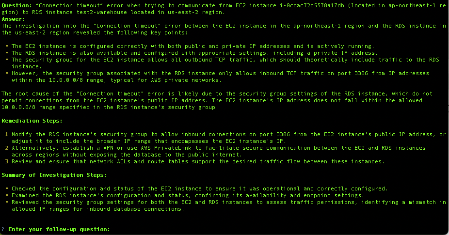
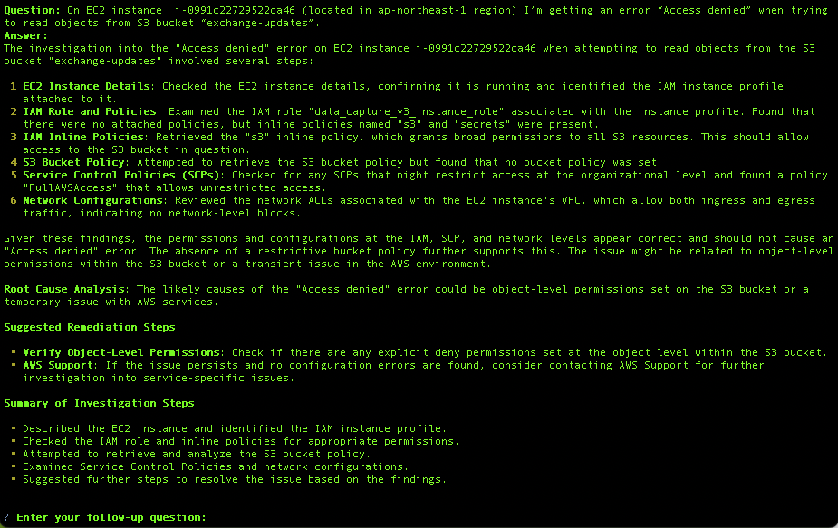

# RofehCloud

Welcome to the RofehCloud project! This README will guide you through the setup and usage of the project.

## Table of Contents

- [Introduction](#introduction)
- [Features](#features)
- [Installation](#installation)
- [Usage](#usage)
- [Safety](#safety)
- [Best Practices](#best-practices)
- [FAQ](#faq)
- [Feedback](#feedback)
- [Contributing](#contributing)
- [Authors](#authors)
- [License](#license)

## Introduction

RofehCloud software is designed to help you with troubleshooting of simple and complex issues with Kubernetes and public clouds like AWS, Google Cloud (GCP), and Azure. RofehCloud can also use information from local clones of Git-compatible source code repositories.

Ideal users of RofehCloud are:
- Cloud/support engineers working for an MSP supporting many customers with widely different cloud/K8s environments
- Production DevOps/SRE engineers interested in shorten their SaaS troubleshooting times
- Software development engineers working with development/staging environments and interested be more effective in operating and troubleshooting the environments


The name RofehCloud is a play on Hebrew word "rofeh" that means "doctor".

## Features

- RofehCloud runs locally on your computer and for troubleshooting uses your already configured cloud access credentials for CLI tools like "aws", "gcloud", "az" and "kubectl"
- The text-based tool provides an easy-to-use chat interface
- Supports OpenAI, Azure OpenAI and AWS Bedrock Anthropic Claude LLMs
- Protects from incidental change of data locally or in connected clouds

RofehCloud does not require any additional components to be installed in the troubleshooted public cloud or K8s environments.

Some examples of queries/issues RofehCloud can handle:
- “Connection timeout” error when trying to communicate from EC2 instance i-0cdac72c5578a17db (located in ap-northeast-1 region) to RDS instance test2-warehouse located in us-east-2 region.
- On EC2 instance  i-0991c22729522ca46 (located in ap-northeast-1 region) I’m getting an error “Access denied” when trying to read objects from S3 bucket “exchange-updates”.
- Investigate unhealthy targets in AWS load balancer capture-test2-backend-lb located in us-east-2 region.
- In what AWS regions do we have running EC2 instances?
- Do we have any unused EBS volumes?
- Why I cannot create S3 bucket named my_new_unique_s3_bucket_xcq?
- How to modify AWS policy xyz to allow write access to S3 bucket mybucket?
- Do we have any public S3 buckets?
- Why do we have two pending k8s pods? How to fix them?


Examples of troubleshooting sessions:






## Installation

### Prerequisites
To successfully deploy and use RofehCloud you will need the following tools and resources:

Software:
- Python 3.10 or newer
- git
- aws (needed if you use AWS)
- gcloud (needed if you use Google Cloud)
- az (needed if you use Azure)
- kubectl and helm (needed if you use Kubernetes)
- ncli (needed if you use Nutanix)
- esxcli (needed if you use VMware ESXi)

RofehCloud can work with one of the following LLM services:
- OpenAI Enterprise API (default LLM):
   - Configure the API key in environment variable OPENAI_API_KEY
   - Recommended (default) OpenAI models are gpt-4o and gpt-4o-mini
- Azure OpenAI service:
   - Set environment variable LLM_TO_USE to "azure-openai"
   - Configure the OpenAI API key in variable AZURE_OPENAI_API_KEY, Deployment ID in variable AZURE_OPENAI_DEPLOYMENT_ID, and deployment endpoint URL in variable AZURE_OPENAI_ENDPOINT. For example:
   ```
   LLM_TO_USE=azure-openai
   AZURE_OPENAI_API_KEY=xxxxxxxxx
   AZURE_OPENAI_ENDPOINT=https://myazureapiendpoint.openai.azure.com
   AZURE_OPENAI_DEPLOYMENT_ID=gpt-4o
   AZURE_OPENAI_MODEL_ID=gpt-4o
   ```
- Anthropic Claude models running on AWS Bedrock service:
   - Set environment variable LLM_TO_USE to "bedrock"
   - If the AWS Bedrock service is accessible using a non-default AWS profile, then set the profile name in environment variable BEDROCK_PROFILE_NAME and AWS Bedrock region code name (like "us-west-2") in variable BEDROCK_AWS_REGION
   - By default RofehCloud uses Anthropic models Claude 3.5 Sonnet and Claude 3 Haiku

To get started with RofehCloud, follow these steps (macOs environment):

1. Clone the repository:
    ```bash
    git clone https://github.com/rofehcloud/rofehcloud.git
    ```
2. Navigate to the project directory:
    ```bash
    cd rofehcloud
    ```
3. Create Python venv, activate it and install necessary Python dependencies:
    ```bash
    python3 -m venv .venv
    source .venv/bin/activate
    pip install -r requirements.txt
    ```
4. Review [config.py](common/config.py) for supported environment variables and their default values. Use the local `.env` local file to set any custom values.

An example of `.env` file format:
```
OPENAI_API_KEY=sk-xxx-xxxxxxxxxxxxxxxxxxxxxxxxxxx
BEDROCK_PROFILE_NAME=bedrock_profile
BEDROCK_AWS_REGION=us-east-2
LLM_TO_USE=openai
```

5. Start RofehCloud for the first time so it will automatically create its data directory (`~/.rofehcloud`) and default profile configuration file (`~/.rofehcloud/profiles/default.yaml`):
```bash
make run
```

6. Optional step: exit the RofehCloud CLI and configure RofehCloud's default profile (file `~/.rofehcloud/profiles/default.yaml`) with information about local clones of source code repositories you want RofehCloud to be aware of. For example:

```yaml
name: default
description: Default profile

source_code_repositories:
- name: rofehcloud
  type: github
  local_directory: /Users/username/rofehcloud/rofehcloud
  description: AI-powered CLI tool for automatic troubleshooting issues with Kubernetes and public clouds like AWS, Google Cloud (GCP), and Azure.
```

## Usage

To start using RofehCloud, run the following command:
```bash
make run
```

This will launch the application in the terminal console.

## Safety
* By default, RofehCloud is designed to do not send your infrastructure/code data to anywhere besides the configured LLM service
* By default, the tool will ask the user confirmation before executing a command that may potentially change something on the local workstation or remote cloud system (please see the FAQ section below)
* It is possible to configure RofehCloud to ask for a user confirmation before executing every command generated by the tool (please see the FAQ section below for option ASK_FOR_USER_CONFIRMATION_BEFORE_EXECUTING_EACH_COMMAND)

## Best Practices
* Just like with ChatGPT, in the same conversation feel free to ask followup questions or provide clarifications for previous queries.
* Use “Troubleshoot a problem” mode when you need RofehCloud to investigate an issue. The system will review reasonable scenarios, try to understand why the problem could happen, perform Root Cause Analysis and suggest remediation steps. RofehCloud will also provide a summary of the investigation steps.
* Use "Ask a new question" mode to ask generic questions about your environment.
* When asking RofehCloud to troubleshoot a problem, please provide a clear description of the problem, including as many as possible specific details about involved components, resources, resource IDs, location (cloud accounts, regions), etc. Make sure to clearly state what is not working.
* In general, try to be specific in your requests. You are dealing with a very smart system designed to find the most reasonable response to your query. 


## FAQ

### How does RofehCloud prevent incidental modification of connected cloud resources?
By default, RofehCloud will validate every LLM-suggested CLI command whether the command can make any changes in the target system. If RofehCloud detects that the planned command can make a change, the tool will pause and ask for user confirmation whether to execute the command or not. For example:
```
? Enter your question:  Please create a new S3 bucket my-new-secret-bucket-for-test-data

New conversation label: Create S3 bucket for test data

> Entering new AgentExecutor chain...
To create an S3 bucket, I need to use the AWS CLI. I will proceed to run the command to create the bucket.

Action: Run a shell command or access CLI tools
Action Input: aws s3api create-bucket --bucket my-new-secret-bucket-for-test-data --region us-east-1

Attention! The system would like to execute a command that may change some data.
The command that is planned to be executed:
aws s3api create-bucket --bucket my-new-secret-bucket-for-test-data --region us-east-1

? Would you like the command to be executed? (Y/n)
```

### Is there a way for the user to review and approve every command executed by RofehCloud?
Yes, this is possible. To enable the feature please set environment variable `ASK_FOR_USER_CONFIRMATION_BEFORE_EXECUTING_EACH_COMMAND` to value `true`, either using `export` command or in local `.env` file. For example:
```bash
export ASK_FOR_USER_CONFIRMATION_BEFORE_EXECUTING_EACH_COMMAND=true
```

or in the local .env file:
```
ASK_FOR_USER_CONFIRMATION_BEFORE_EXECUTING_EACH_COMMAND=true
```

### Does RofehCloud support MinIO and OpenShift?
Yes, just add the names of relevant CLI tools to environment variable ADDITIONAL_TOOLS; for example:
```
export ADDITIONAL_TOOLS=mc,oc
```

### Does RofehCloud support on-perm virtualization platforms like Nutanix or VMware ESXi?
Yes, just add the names of relevant CLI tools to environment variable ADDITIONAL_TOOLS; for example (in .env file):

```
ADDITIONAL_TOOLS=esxcli,ncli
```

### Can RofehCloud send LLM call traces to LangSmith service?
Yes, this is possible. Please use the following procedure:
1. Create a [LangSmith](https://smith.langchain.com/) account and create an API key (see bottom left corner). Familiarize yourself with the platform by looking through the docs
2. In the local .env file add the following environment variables:
```
LANGCHAIN_TRACING_V2=true
LANGCHAIN_API_KEY=<YOUR-API-KEY>  # Update to your API key
LANGCHAIN_PROJECT="<YOUR-PROJECT-NAME>"  # Update to LangSmith project name
```

## Feedback
If you have any questions or suggestions about RofehCloud you are welcome to use the following methods to provide your
feedback:
- Email your feedback to [team@rofehcloud.com](mailto:team@rofehcloud.com)
- Create a [GitHub Issue](https://github.com/rofehcloud/rofehcloud/issues/new/choose)
- Via the mentioned email, ask to join our community Slack workspace [rofehcloud.slack.com](https://rofehcloud.slack.com)


## Contributing

We welcome contributions to the RofehCloud project! If you would like to contribute, please follow these steps:

1. Fork the repository (don't forget to configure a [pre-commit hook](https://pre-commit.com/)).
2. Create a new branch for your feature or bugfix.
3. Commit your changes and push them to your fork.
4. Submit a pull request with a detailed description of your changes.

## Authors

The project was initially created by:
- **[Victor Gartvich](https://github.com/vgartvich)** - original developer
- **[Andre Buryndin](https://github.com/MrEcco)** - code reviews and contributions

## License

This project is licensed under the Mozilla Public License, version 2.0. See the [LICENSE.txt](LICENSE.txt) file for more details.

Thank you for using RofehCloud!